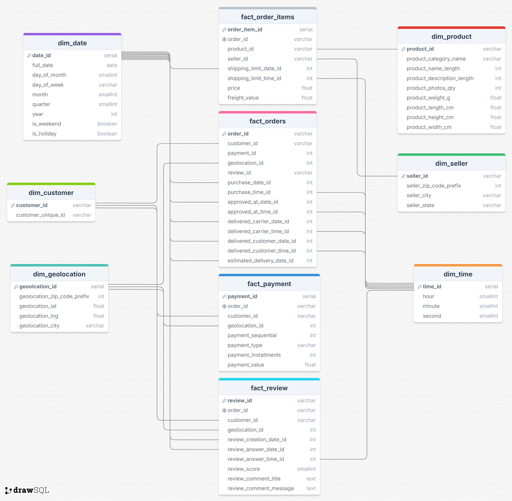

# Brazilian E-commerce Dataset Kimball Redesign

Redesign of the [OLTP Brazilian e-commerce dataset (Olist)](https://www.kaggle.com/datasets/olistbr/brazilian-ecommerce) into a denormalized Kimball star schema with fact and dimension tables, creating an OLAP data warehouse optimized for analytics and reporting. The warehouse is built on Snowflake and managed via Snowsight.

### Key Features
- Denormalized dimensions for fast analytical queries  
- Fact tables capturing orders, order items, payments, and reviews  
- Data processed and staged entirely in Snowflake  
- Designed for OLAP workloads (aggregations, BI dashboards, etc.)  

## Schema Overview



### Dimensions
| Dimension | Description |
|-----------|-------------|
| `dim_date` | Calendar information for orders and events |
| `dim_time` | Time of day information for orders |
| `dim_customer` | Customer details including location and demographics |
| `dim_product` | Product details and categories |
| `dim_seller` | Seller information |
| `dim_geolocation` | Geolocation of customers and sellers |

### Fact Tables
| Fact Table | Description |
|------------|-------------|
| `fact_orders` | Orders placed by customers |
| `fact_order_items` | Individual items in each order |
| `fact_payment` | Payment details for orders |
| `fact_review` | Customer reviews for orders |

The fact tables reference the dimensions using foreign keys, forming a star schema optimized for analytical queries. Some fact tables also include Kimball-style degenerate keys, which are keys derived from transactional identifiers (like `order_id`) that don’t link to a dimension table or a fact table (in other words, no referential integrity is required) but are useful for query joins and reporting. These keys are flagged with a snowflake icon in the visual schema.

## Phases

The data pipeline follows three main phases:

1. **Stage raw data**  
   - Raw CSV files from Olist were uploaded to the Snowflake stage: `@OLIST_STAGE`.  
   - Tables created: `raw_customers`, `raw_orders`, `raw_order_items`, `raw_order_payments`, `raw_order_reviews`, `raw_products`, `raw_sellers`, `raw_geolocation`, `raw_product_category_name_translation`.  

2. **Load into warehouse schema**  
   - Raw data was read from the stage into Snowflake tables.  
   - Dimension and fact tables were populated according to the **Kimball star schema**.  
   - Data was denormalized where appropriate to optimize OLAP queries.  

3. **Export and cleanup**  
   - Populated tables were exported to `@KIMBALL_STAGE` for staging/backup purposes.  
   - Original raw tables and staged files were dropped to free storage and finalize the warehouse.  

## How to Explore

To reproduce the warehouse locally using the provided SQL script and original dataset:

1. Download the [original Olist dataset](https://www.kaggle.com/datasets/olistbr/brazilian-ecommerce) from the provided link.
2. Create the `@OLIST_STAGE` on Snowflake and upload all the raw CSV files.
4. Run and review the full SQL script in this repository to see how the raw data is transformed into the Kimball star schema.  
5. Congrats! You now have the final populated tables in your warehouse.

Note: In case you need the new dataset in form of CSV files, you'll need to manually create another stage called `@KIMBALL_STAGE` and it will be automatically populated with the final data. If not, **MAKE SURE** to remove the following part from the SQL script:

```sql
-- ========================
-- DIMENSIONS (split files)
-- ========================
COPY INTO @KIMBALL_STAGE/dim_date/
FROM dim_date
FILE_FORMAT = (TYPE = CSV FIELD_OPTIONALLY_ENCLOSED_BY='"' COMPRESSION = NONE)
OVERWRITE = TRUE;

COPY INTO @KIMBALL_STAGE/dim_time/
FROM dim_time
FILE_FORMAT = (TYPE = CSV FIELD_OPTIONALLY_ENCLOSED_BY='"' COMPRESSION = NONE)
OVERWRITE = TRUE;

COPY INTO @KIMBALL_STAGE/dim_customer/
FROM dim_customer
FILE_FORMAT = (TYPE = CSV FIELD_OPTIONALLY_ENCLOSED_BY='"' COMPRESSION = NONE)
OVERWRITE = TRUE;

COPY INTO @KIMBALL_STAGE/dim_product/
FROM dim_product
FILE_FORMAT = (TYPE = CSV FIELD_OPTIONALLY_ENCLOSED_BY='"' COMPRESSION = NONE)
OVERWRITE = TRUE;

COPY INTO @KIMBALL_STAGE/dim_seller/
FROM dim_seller
FILE_FORMAT = (TYPE = CSV FIELD_OPTIONALLY_ENCLOSED_BY='"' COMPRESSION = NONE)
OVERWRITE = TRUE;

COPY INTO @KIMBALL_STAGE/dim_geolocation/
FROM dim_geolocation
FILE_FORMAT = (TYPE = CSV FIELD_OPTIONALLY_ENCLOSED_BY='"' COMPRESSION = NONE)
OVERWRITE = TRUE;


-- ===================
-- FACTS (split files)
-- ===================
COPY INTO @KIMBALL_STAGE/fact_orders/
FROM fact_orders
FILE_FORMAT = (TYPE = CSV FIELD_OPTIONALLY_ENCLOSED_BY='"' COMPRESSION = NONE)
OVERWRITE = TRUE;

COPY INTO @KIMBALL_STAGE/fact_order_items/
FROM fact_order_items
FILE_FORMAT = (TYPE = CSV FIELD_OPTIONALLY_ENCLOSED_BY='"' COMPRESSION = NONE)
OVERWRITE = TRUE;

COPY INTO @KIMBALL_STAGE/fact_payment/
FROM fact_payment
FILE_FORMAT = (TYPE = CSV FIELD_OPTIONALLY_ENCLOSED_BY='"' COMPRESSION = NONE)
OVERWRITE = TRUE;

COPY INTO @KIMBALL_STAGE/fact_review/
FROM fact_review
FILE_FORMAT = (TYPE = CSV FIELD_OPTIONALLY_ENCLOSED_BY='"' COMPRESSION = NONE)
OVERWRITE = TRUE;
